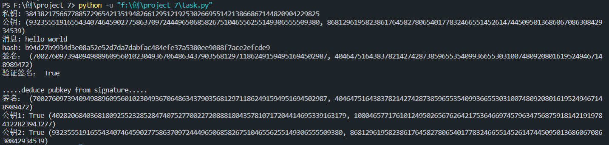

Project: report on the application of this deduce technique in Ethereum with ECDSA （Deduce public key from signature）

etherenum中所用到的ecdsa，secp256k1是如何从签名恢复公钥的

https://github.com/ethereum/go-ethereum/blob/ff2259457ae218ecc9f15fb56c65a6dc51164823/crypto/secp256k1/libsecp256k1/src/modules/recovery/main_impl.h

由secp256k1曲线参数和曲线方程可知，通常指望恢复两个公钥。

