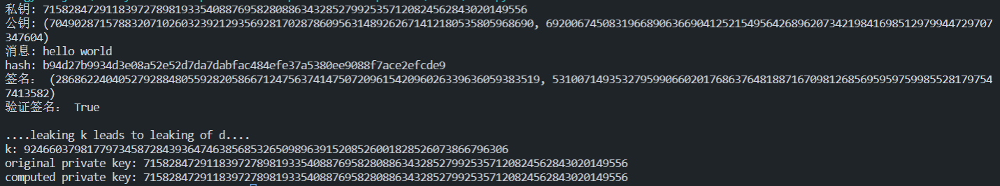
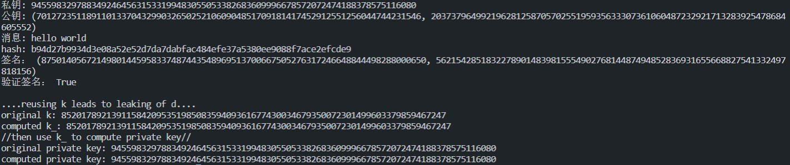
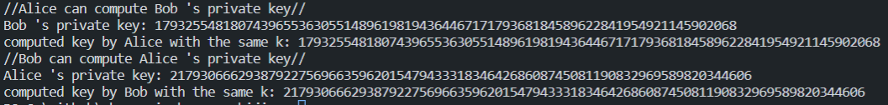

## Leaking k leads to leaking of d

## Reusing k leads to leaking of d

## Two users, using k leads to leaking of d, that is they can deduce each other's d

因为泄露k会导致泄露私钥，如果两个用户使用一样的k，其中一个用户便能用自己的k计算出另一个人的私钥

ECDSA比sm2签名简单，所以本质和泄露k是一样的

