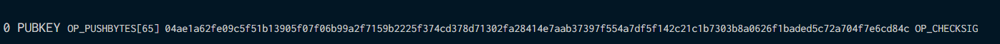
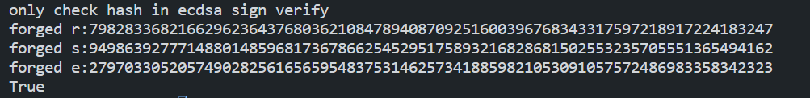

这个project的原理还是比较易懂的，反而是再找satoshi的公钥多花了一些时间

我一开始去查bitcoin早些时间的block，发现很多比特币根本没有交易，于是查了会google，查到 The first ever bitcoin transaction from Satoshi to Hal Finney，block170上，然后发现这个交易，用的是P2PK，就是说public key在output里面，而不是像P2PKH在input里面

也是搜索了半天才发现公钥在output里面，发现并不是P2KPH(hash160)

（感谢https://bitcointalk.org/index.php?topic=5192074.msg52725370#msg52725370，不然我可能得找更久）

也就说04ae1a62fe09c5f51b13905f07f06b99a2f7159b2225f374cd378d71302fa28414e7aab37397f554a7df5f142c21c1b7303b8a0626f1baded5c72a704f7e6cd84c是公钥，04表示不压缩，即公钥为：

(0xae1a62fe09c5f51b13905f07f06b99a2f7159b2225f374cd378d71302fa28414,0xe7aab37397f554a7df5f142c21c1b7303b8a0626f1baded5c72a704f7e6cd84c)

